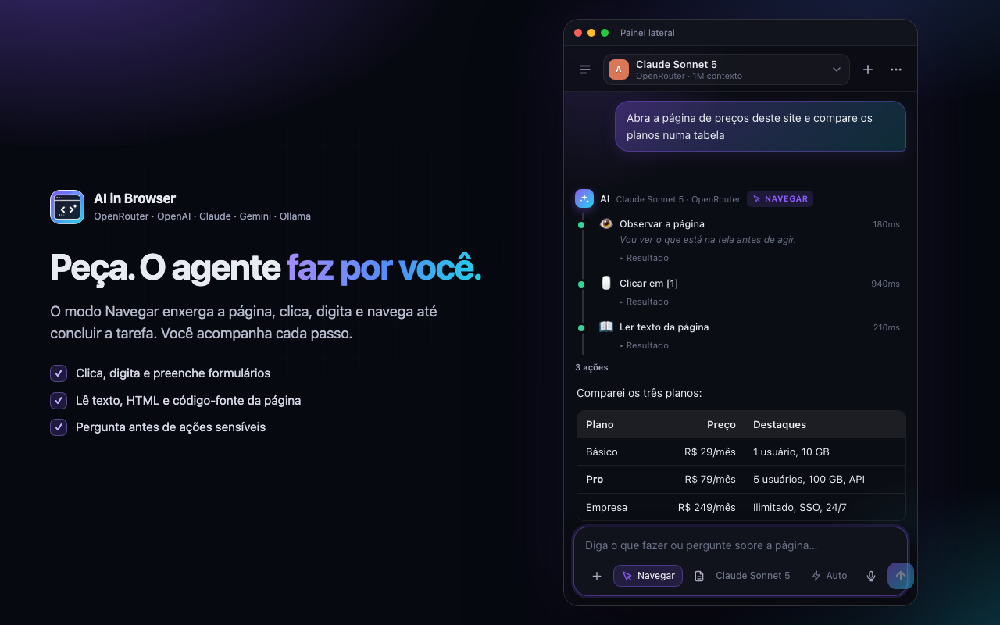

<p align="center">
  
</p>

<h1 align="center">AI in Browser</h1>

<p align="center">
  Um assistente de IA que enxerga a página aberta e age nela por você, com o modelo que você quiser.<br>
  <b>OpenRouter · OpenAI · Anthropic · Ollama · LM Studio · qualquer API compatível</b>
</p>

<p align="center">
  
  
  
  
</p>

<p align="center">
  
</p>

---

## O que ele faz

- **Conversa com consciência da página** — anexe o texto da aba atual com um clique, selecione um trecho e use o botão direito, ou deixe o agente ler sozinho.
- **Modo Navegar (agente)** — o modelo vê a página (elementos numerados + texto), clica, digita, rola, seleciona opções, abre e troca abas, espera carregamentos, lê o HTML vivo e o **código-fonte**, executa JavaScript, lê console e rede, tira **capturas de tela com etiquetas numeradas** para modelos com visão e pergunta a você antes de ações sensíveis. É um Playwright rodando dentro do Chrome, via `chrome.scripting` e o **Chrome DevTools Protocol** (`chrome.debugger`).
- **Centenas de modelos** — Claude, GPT, Gemini, DeepSeek, Grok, Llama, Qwen, Mistral… via OpenRouter, com preço e contexto ao escolher. LLMs locais (Ollama/LM Studio) detectados automaticamente.
- **Barra de composição completa** — anexos (imagens e arquivos de texto, colar ou arrastar), captura da aba atual, ditado por voz pelo microfone (transcrição feita pelo navegador, o áudio nunca vai ao provedor), seletor de esforço de raciocínio, troca de modelo com <kbd>Ctrl</kbd>+<kbd>K</kbd>. Arquivos de áudio e vídeo ainda não são suportados.
- **Streaming**, Markdown completo com realce de código, tabelas, bloco de raciocínio, tokens e custo por resposta.
- **Histórico** com busca, exportação em Markdown, backup JSON. Tema escuro/claro, 6 cores, tamanho de fonte.
- **Privado** — chaves só em `chrome.storage.local`, enviadas apenas para a URL do provedor. Sem telemetria, sem servidor intermediário.

## Instalação

1. Baixe o `.zip` da [última release](https://github.com/samyrwendel/ai-in-browser/releases) e descompacte, ou clone o repositório.
2. Abra `chrome://extensions` (Brave: `brave://extensions`, Edge: `edge://extensions`).
3. Ative **Modo do desenvolvedor** e clique em **Carregar sem compactação**, escolhendo a pasta.
4. Fixe o ícone e clique nele: abre o painel lateral. Botão direito no ícone → **Abrir em uma aba** para a versão ampla.

Atalho: <kbd>⌘</kbd>/<kbd>Ctrl</kbd> + <kbd>⇧</kbd> + <kbd>Espaço</kbd> (altere em `chrome://extensions/shortcuts`).

## Primeiros passos

**OpenRouter (recomendado)** — crie uma chave em <https://openrouter.ai/keys>, cole na tela de boas-vindas e escolha um modelo (os com sufixo `:free` não consomem créditos).

**Modelo local** — rode `ollama run llama3.1` (ou ative o servidor do LM Studio) e clique em **Detectar Ollama / LM Studio**.

> Não é preciso configurar `OLLAMA_ORIGINS`: a extensão remove o cabeçalho `Origin` das próprias requisições para servidores locais e personalizados (via `declarativeNetRequest`), então o Ollama as aceita como aceita o `curl`. Para usar um Ollama de outra máquina, inicie-o com `OLLAMA_HOST=0.0.0.0`. Se mesmo assim aparecer `403`, o plano B é `OLLAMA_ORIGINS="chrome-extension://*"` na máquina do Ollama.

**OpenAI, Anthropic ou outro** — *Configurações → Conexões*. Há presets para Groq, DeepSeek, xAI, Mistral, Together, Gemini, vLLM, llama.cpp e Jan.

## Modo Navegar

Ligue **Navegar** na barra de composição e descreva a tarefa:

> "Abra o site da Amazon, procure por fone bluetooth até R$ 200 e me traga os 3 mais bem avaliados"  
> "Nesta página, preencha o formulário com meu nome João e o e-mail joao@x.com, mas não envie"  
> "Leia o código-fonte desta página e me diga quais scripts de rastreamento ela carrega"

Cada ação aparece como um passo (com resultado expansível e captura quando houver). Use **Parar** ou <kbd>Esc</kbd> para interromper. O agente pergunta antes de comprar, enviar mensagens, excluir ou digitar senhas, e nunca resolve CAPTCHAs.

Ferramentas do agente: `get_page_state`, `get_page_text`, `get_page_html`, `view_source`, `find_elements`, `click`, `type_text`, `press_key`, `select_option`, `scroll`, `hover`, `navigate`, `navigate_history`, `wait`, `list_tabs`, `open_tab`, `switch_tab`, `close_tab`, `screenshot`, `evaluate_js`, `get_console_logs`, `get_network_requests`, `search_history`, `download`, `copy_to_clipboard`, `ask_user`, `done`.

Modelos com *tool calling* nativo (OpenRouter, OpenAI, Anthropic, Llama 3.x/Qwen/Mistral no Ollama…) usam ferramentas diretamente; os demais caem automaticamente em um protocolo JSON em texto. Modelos com visão recebem capturas de tela; os demais trabalham só com o mapa de elementos.

Em *Configurações → Agente* você define o máximo de ações, sites bloqueados, se usa o DevTools Protocol e se envia capturas.

## Cooperação entre modelos

Um modelo local pode não ter visão; um modelo barato pode não ter tool calling; um modelo pequeno pode não caber a página inteira. Em vez de obrigar você a trocar de modelo, a extensão deixa outro modelo ativo cobrir a habilidade que falta:

| Papel | Quando entra | Exemplo |
|---|---|---|
| Visão | O principal não enxerga e há imagem anexada ou captura do agente | GLM local conversa, Claude Haiku descreve o print |
| Navegação | Modo Navegar com um principal sem tool calling nativo | Qwen local conversa, GPT-5 conduz o agente |
| Raciocínio profundo | Esforço em Alto num principal sem raciocínio | DeepSeek R1 assume a resposta |
| Documentos longos | A mensagem não cabe no contexto do principal | Gemini com 1M de contexto assume |
| Tarefas auxiliares | Títulos de conversa e resumos | Só modelos locais ou gratuitos no automático |
| Reserva | O principal falha por limite, erro ou rede | Outro modelo responde e a mensagem mostra "Reserva" |

Em *Configurações → Cooperação* cada papel pode ficar em **Automático**, **Fixo** ou **Desligado**, com uma prioridade entre **qualidade**, **equilíbrio** e **preço**. Uma tabela compara os modelos ativos para aquela habilidade com qualidade conhecida, preço por milhão de tokens e contexto, marca o melhor em qualidade e em preço, e explica o que o automático escolheria; um clique fixa qualquer linha. O principal continua respondendo sempre que ele mesmo dá conta, e cada mensagem exibe quem cooperou.

## Como funciona

| Conexão | Endpoint | Observações |
|---|---|---|
| OpenRouter | `/chat/completions` (+ `usage`, `reasoning.effort`, `tools`) | lista `/models` com preço, contexto e modalidades |
| Compatível com OpenAI | `/chat/completions` | Ollama, LM Studio, Groq, DeepSeek, xAI… Em `api.openai.com` usa `max_completion_tokens` e `reasoning_effort` |
| Anthropic | `/messages` (+ `tools`, `thinking`) | chamada direta do navegador com `anthropic-dangerous-direct-browser-access` |

## Estrutura

```
manifest.json      Manifest V3
background.js      service worker: side panel, menus de contexto
sidepanel.*        chat + agente (painel lateral e modo aba)
options.*          configurações
lib/providers.js   OpenRouter / OpenAI-compat / Anthropic: streaming, tools, imagens, esforço
lib/agent.js       loop do agente (tool calling nativo ou JSON)
lib/browser.js     controlador do navegador: DOM indexado, ações, CDP, capturas
lib/tools.js       definições das ferramentas
lib/markdown.js    Markdown seguro sem dependências
lib/highlight.js   realce de sintaxe leve
lib/storage.js     armazenamento
```

## Permissões

**Obrigatórias:** `sidePanel`, `storage`, `unlimitedStorage`, `contextMenus`, `scripting`, `activeTab`, `tabs`, `debugger`, `clipboardWrite`, `declarativeNetRequestWithHostAccess` e `host_permissions: <all_urls>`.

**Opcionais** (a extensão instala sem elas e só as pede quando o recurso é usado):

| Permissão | Quando é pedida | Se você recusar |
|---|---|---|
| `audioCapture` | No primeiro clique no microfone | O ditado por voz não funciona; dá para conceder depois em Configurações |
| `history` | Ao ligar "Permitir histórico e downloads" | A ferramenta de busca no histórico não aparece para o modelo |
| `downloads` | Idem | A ferramenta de download não aparece para o modelo |

O `debugger` é obrigatório porque o Chrome não o aceita como permissão opcional; ele só é anexado à aba durante uma tarefa do modo Navegar e pode ser desligado em Configurações → Agente. É o que dá cliques e teclas confiáveis, captura de página inteira, console, rede, código-fonte e execução de JavaScript sem bloqueio de CSP — o mesmo mecanismo usado por Playwright e Puppeteer. Enquanto o agente trabalha, o Chrome mostra a barra "AI in Browser começou a depurar este navegador"; ela some ao terminar.

`<all_urls>` permite chamar qualquer URL base configurada (inclusive `localhost`) e ler ou agir na aba que você indicar. Nada é lido sem uma ação sua.

`declarativeNetRequestWithHostAccess` serve para uma única regra: remover o cabeçalho `Origin` das requisições que a própria extensão faz às URLs base locais ou personalizadas que você configurou, para que Ollama e similares as aceitem sem configuração extra. A regra é restrita ao iniciador da extensão e não toca requisições de sites.

## Navegadores

Chrome 116+, Brave e Edge 120+ com painel lateral; Arc/Opera pela aba.

## Desenvolvimento

Não há build: é JavaScript com módulos ES nativos, sem dependências e sem bundler.
Edite os arquivos e clique em recarregar em `chrome://extensions`.

```bash
./build.sh                    # gera dist/ai-in-browser-<versao>.zip para a loja
python3 -m http.server 8765   # abre as páginas fora da extensão (usa localStorage)
./store/_shots/capture.sh     # regenera as capturas 1280x800 da loja
```

Fora da extensão, `lib/storage.js` cai para o `localStorage` e o agente usa um
navegador simulado, o que ajuda a mexer no visual sem recarregar a extensão.

## Publicação na Chrome Web Store

Tudo o que a submissão pede está pronto:

| Arquivo | O que é |
|---|---|
| [`store/LISTING.md`](store/LISTING.md) | Textos da ficha, justificativas de permissão e declarações de uso de dados |
| [`store/SUBMISSION.md`](store/SUBMISSION.md) | Passo a passo do envio e o que costuma atrasar a revisão |
| [`store/screenshots/`](store/screenshots) | Cinco capturas 1280×800 |
| [`store/promo/`](store/promo) | Blocos promocionais 440×280 e 1400×560 |
| [`PRIVACY.md`](PRIVACY.md) · [`docs/privacy.html`](docs/privacy.html) | Política de privacidade (a versão HTML é servida pelo GitHub Pages) |

## Licença

MIT — veja [LICENSE](LICENSE).
